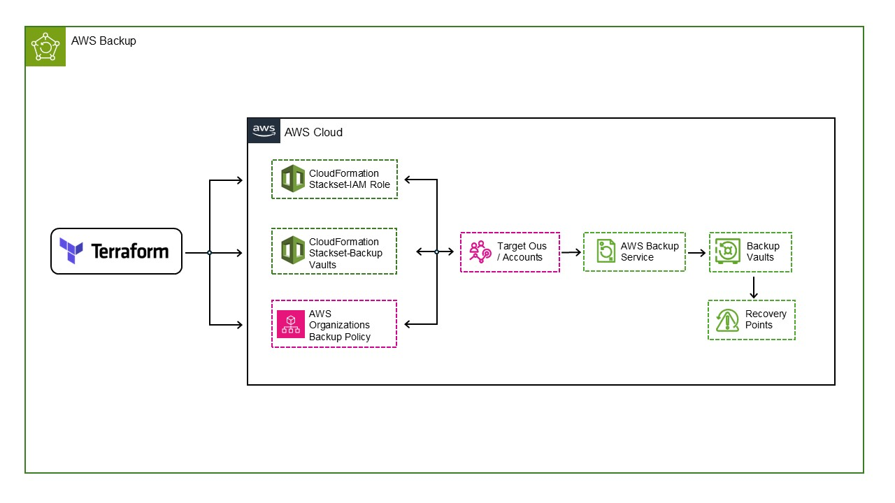

# AWS Backups

<!-- Badges principais do projeto -->


## Architecture

O diagrama seguinte ilustra a arquitetura centralizada de backups AWS implementada neste projeto.



## Visão geral

Este repositório implementa **governança centralizada de backups para AWS Organizations**, utilizando:

- **Terraform** – orquestração e modelagem das políticas
- **AWS Backup** – execução dos planos de backup e armazenamento dos recovery points
- **AWS Organizations Backup Policies** – governança central aplicada a Unidades Organizacionais (OUs)
- **CloudFormation StackSets** – distribuição multi-conta e multi-região de roles IAM e Backup Vaults

O objetivo é dar às equipas de plataforma/landing zone uma forma repetível de:

- definir horários de backup e retenção de forma centralizada
- aplicar essas regras em múltiplas contas e OUs da organização
- usar seleção baseada em tags, de forma que as equipas de aplicação só precisem marcar os recursos
- provisionar de forma consistente os roles IAM e Backup Vaults necessários em cada conta/região

No núcleo, este projeto cria:

- uma **AWS Organizations Backup Policy** chamada `org-backup-policy`
- um **IAM Role para AWS Backup** chamado `backup-operations-role`
- **Backup Vaults** (`backup-vault-dev`, `backup-vault-qua`, `backup-vault-prod`) com encriptação KMS e parâmetros de Vault Lock
- seleções de backup baseadas na tag `backup_plan`

---

## Arquitetura

A arquitetura é implementada em três camadas que trabalham em conjunto para entregar governança centralizada de backups.

### 1. Camada de orquestração com Terraform

O código Terraform em `terraform_backup/` é responsável por:

- Definir a configuração (nomes, regiões, OUs, planos, vaults, tags) em `backup_locals.tf`.
- Transformar essa configuração na estrutura JSON esperada pelas **AWS Organizations Backup Policies**.
- Criar o recurso `aws_organizations_policy` do tipo `BACKUP_POLICY`.
- Anexar essa política às OUs alvo (`target_ou_ids`).
- Criar CloudFormation StackSets que distribuem os IAM Roles e Backup Vaults para todas as contas nas OUs.

### 2. Camada de distribuição com CloudFormation StackSets

Os StackSets definidos pelo Terraform são responsáveis por fazer o deploy de recursos **dentro de cada conta membro**:

- Um **IAM Role de AWS Backup** em cada conta, com a trust policy e managed policies corretas.
- Um ou mais **Backup Vaults** em cada combinação conta/região, incluindo chaves KMS dedicadas e configuração opcional de Vault Lock.

O Terraform apenas define os StackSets e as suas instâncias. O CloudFormation executa o fan-out real para todas as contas e regiões configuradas em cada StackSet.

### 3. Camada de execução com AWS Backup

Depois que:

1. Os IAM Roles existem nas contas
2. Os Backup Vaults existem nas contas/regiões
3. A `BACKUP_POLICY` da organização está anexada às OUs

… o **AWS Backup** aplica automaticamente a política em cada conta membro:

- Interpreta os planos de backup definidos na política (agendas, lifecycle, vaults alvo).
- Usa **seleção baseada em tags** para decidir quais recursos proteger.
- Cria recovery points nos Backup Vaults apropriados, de acordo com agenda e retenção.

### Fluxo ponta a ponta

O fluxo ponta a ponta implementado neste repositório é:

1. **Terraform** lê `terraform_backup/backup_locals.tf` e deriva:
   - planos de backup por ambiente (DEVELOPMENT, QUALITY, PRODUCTION)
   - mapeamento de ambientes para vaults
   - conjunto de OUs alvo
   - restrições de Vault Lock por vault
2. **Terraform** cria o StackSet de IAM Role (`aws_cloudformation_stack_set.role`) e as suas instâncias para todas as OUs alvo.
3. **Terraform** cria os StackSets de Vaults (`aws_cloudformation_stack_set.vault`) e as instâncias para cada combinação vault+região.
4. **CloudFormation StackSets** fazem rollout dos IAM Roles e Backup Vaults em cada conta das OUs alvo.
5. **Terraform** cria a `BACKUP_POLICY` na AWS Organizations, com o conteúdo JSON derivado dos locals.
6. **Terraform** anexa essa política a todas as OUs alvo via `aws_organizations_policy_attachment.backup`.
7. **AWS Backup** aplica a política em cada conta, selecionando recursos por tag e executando backups para os vaults configurados.

---

## Estrutura do repositório

```text
aws.landzone.backups/
├─ README.md
├─ CHANGELOG.md
├─ CONTRIBUTING.md
├─ LICENSE
├─ SECURITY.md
├─ .gitignore
├─ terraform_backup/
│  ├─ versions.tf
│  ├─ providers.tf
│  ├─ backup_locals.tf
│  ├─ backup_policy.tf
│  ├─ backup_stackset.tf
│  ├─ backup_vaults.tf
│  └─ backup_output.tf
├─ cloudformation/
│  ├─ role.yaml
│  └─ vault.yaml
├─ docs/
│  ├─ architecture.md
│  ├─ configuration.md
│  ├─ costs.md
│  ├─ runbook.md
│  ├─ security.md
│  ├─ restore-testing.md
│  ├─ development.md
│  ├─ diagrams/
│  │  ├─ architecture.md
│  │  └─ architecture.drawio
│  └─ decisions/
│     ├─ README.md
│     ├─ ADR-001-terraform-cloudformation.md
│     ├─ ADR-002-organization-backup-policy.md
│     ├─ ADR-003-stacksets-for-distribution.md
│     └─ ADR-004-vault-lock-retention.md
├─ examples/
│  └─ example-organization-config.md
└─ example-organization-config.md
```

---

## Componentes Terraform

### `terraform_backup/backup_locals.tf`

Este ficheiro é o **modelo de configuração central** de toda a solução. Nele são definidos:

- **Política e nomenclatura**
  - `name = "org-backup-policy"` – nome lógico da AWS Organizations Backup Policy.
  - `backup_role_name = "backup-operations-role"` – nome do IAM Role que será criado nas contas membro.
  - `backup_tag_name = "backup_plan"` – chave de tag usada para selecionar recursos para backup.

- **Regiões**
  - `backup_region = "eu-south-2"` – região principal onde os StackSets correm e onde os vaults são modelados.
  - `backup_regions = [local.backup_region]` – lista de regiões onde a política se aplica (atualmente uma única região, mas já modelado como lista para expansão futura).

- **OUs alvo**
  - `target_ou_ids` – lista de IDs de OU:
    - por exemplo, `"ou-xxxx-aaaaaaaa"`, `"ou-yyyy-bbbbbbbb"` (valores fictícios)
  - Estes valores devem ser substituídos pelos IDs reais das OUs da sua organização.
  - A Backup Policy e os StackSets vão aplicar-se a **todas as contas dentro destas OUs**.

- **Tags globais**
  - `tags` – mapa de tags aplicadas aos recursos criados (por exemplo, `environment = "org"`, `owner = "platform"`).
  - Utilizado para governação, billing e inventário.

- **Planos de backup por ambiente** (`backup_plans_input`)

  A solução define três ambientes lógicos:

  - `DEVELOPMENT`
  - `QUALITY`
  - `PRODUCTION`

  Cada ambiente inclui:

  - `schedule` – expressão cron AWS usada pelo AWS Backup (por exemplo, `cron(0 5 ? * * *)`).
  - `start_window_minutes` – janela permitida para o início do job de backup.
  - `complete_window_minutes` – janela permitida para conclusão do job.
  - `vault_name` – nome do vault para onde esse ambiente escreve (por exemplo, `backup-vault-dev`).
  - `lifecycle.delete_after_days` – número de dias antes de eliminar os recovery points.

  Concretamente neste código:

  - **DEVELOPMENT**
    - Agenda: `cron(0 5 ? * * *)` (diário às 05:00).
    - Retenção: `delete_after_days = 35`.
    - Vault: `backup-vault-dev`.
  - **QUALITY**
    - Agenda: `cron(0 3 ? * * *)` (diário às 03:00).
    - Retenção: `delete_after_days = 35`.
    - Vault: `backup-vault-qua`.
  - **PRODUCTION**
    - Agenda: `cron(0 1 ? * * *)` (diário às 01:00).
    - Retenção: `delete_after_days = 90`.
    - Vault: `backup-vault-prod`.

- **Configuração dos Vaults** (`vaults`)

  Cada Backup Vault tem parâmetros específicos relacionados com Vault Lock:

  - `name` – nome do vault (por exemplo, `backup-vault-dev`).
  - `change_grace_days` – número de dias em que a configuração de Vault Lock pode ser alterada.
  - `min_retention_days` – retenção mínima forçada pelo Vault Lock.
  - `max_retention_days` – retenção máxima forçada pelo Vault Lock.

  Na configuração atual:

  - `backup-vault-dev`
    - `change_grace_days = 30`
    - `min_retention_days = 35`
    - `max_retention_days = 365`
  - `backup-vault-qua`
    - `change_grace_days = 30`
    - `min_retention_days = 35`
    - `max_retention_days = 365`
  - `backup-vault-prod`
    - `change_grace_days = 30`
    - `min_retention_days = 90`
    - `max_retention_days = 365`

- **Caminhos dos templates CloudFormation**

  - `cf_dir = "${path.module}/../cloudformation"` – aponta de `terraform_backup/` para o diretório partilhado `cloudformation/`.
  - `cf_vault_tpl = file("${local.cf_dir}/vault.yaml")`.
  - `cf_role_tpl  = file("${local.cf_dir}/role.yaml")`.

- **Estruturas derivadas**

  - `vaults_per_region` – mapa indexado por `lower("${backup_region}-${vault.name}")` com valores `{ vault, region }`. Hoje usa apenas uma região, mas está pronto para expansão.
  - `all_role_names` – conjunto de nomes de role a serem deployados via StackSet (atualmente apenas `backup-operations-role`).
  - `backup_plans` – **ponto crítico**: transforma `backup_plans_input` na estrutura JSON exigida pela Organizations Backup Policy:
    - `regions` – lista de regiões atribuída via `"@@assign" = local.backup_regions`.
    - `rules` – para cada plano, apontando para o `target_backup_vault_name` e para a sua agenda.
    - `lifecycle` – combina `cold_storage_after_days` (se definido) e o obrigatório `delete_after_days`.
    - `selections.tags.backup-policy` – define a **seleção baseada em tags**:
      - `iam_role_arn = "arn:aws:iam::$account:role/backup/${local.backup_role_name}"`.
      - `tag_key = backup_tag_name` (ou seja, `backup_plan`).
      - `tag_value = [plan_name]` – por exemplo `["DEVELOPMENT"]`, `["QUALITY"]`, `["PRODUCTION"]`.
    - `backup_plan_tags` – converte o mapa `tags` em pares chave/valor para etiquetar o próprio plano de backup.

Em resumo: `backup_locals.tf` descreve completamente **o que** deve ser protegido, **onde**, **com que frequência**, **por quanto tempo** e **em que vault** o backup é armazenado.

### `terraform_backup/backup_policy.tf`

Este ficheiro transforma os locals calculados numa AWS Organizations Backup Policy e anexa essa política às OUs selecionadas.

- `aws_organizations_policy "backup"`:
  - `name = local.name` → `org-backup-policy`.
  - `type = "BACKUP_POLICY"` – tipo especial de política da Organizations para AWS Backup.
  - `content = jsonencode({ plans = local.backup_plans })` – converte a estrutura `backup_plans` dos locals em JSON.

- `aws_organizations_policy_attachment "backup"`:
  - `for_each = toset(local.target_ou_ids)`.
  - `policy_id = aws_organizations_policy.backup.id`.
  - `target_id = each.value` – anexa a política a cada OU presente em `target_ou_ids`.
  - `depends_on = [ aws_cloudformation_stack_set_instance.role, aws_cloudformation_stack_set_instance.vault ]` – garante que os IAM Roles e Vaults estão deployados **antes** da política ser anexada.

**Conceito: tipo BACKUP_POLICY**

Uma `BACKUP_POLICY` da Organizations permite definir planos de backup de forma centralizada e aplicá-los a OUs. A AWS interpreta automaticamente o JSON e configura o AWS Backup em cada conta no escopo, incluindo agendas, mapeamento de vaults e seleções baseadas em tags.

### `terraform_backup/backup_stackset.tf`

Este ficheiro define o **CloudFormation StackSet** que distribui o IAM Role usado pelo AWS Backup.

- `aws_cloudformation_stack_set "role"`:
  - `name = format("%s-role", local.name)` – por exemplo, `org-backup-policy-role`.
  - `description = "Provisions IAM roles for AWS Backup"`.
  - `template_body = local.cf_role_tpl` – carrega [terraform_backup/cloudformation/role.yaml](terraform_backup/cloudformation/role.yaml).
  - `permission_model = "SERVICE_MANAGED"` – usa a integração de StackSets com AWS Organizations.
  - `capabilities = ["CAPABILITY_NAMED_IAM", "CAPABILITY_AUTO_EXPAND", "CAPABILITY_IAM"]`.
  - `auto_deployment` com `enabled = true` e `retain_stacks_on_account_removal = false` – o StackSet faz auto-deploy para novas contas nas OUs alvo.
  - `operation_preferences` ajustadas para rollout paralelo.
  - `lifecycle.ignore_changes = [administration_role_arn]` – evita drift na configuração do role de administração.

- `aws_cloudformation_stack_set_instance "role"`:
  - `for_each = toset(local.all_role_names)` – atualmente apenas um nome de role.
  - `stack_set_name = aws_cloudformation_stack_set.role.name`.
  - `stack_set_instance_region = local.backup_region` – região onde o StackSet é operado.
  - `parameter_overrides`:
    - `RoleName = each.value`.
    - `RolePath = "/backup/"`.
  - `deployment_targets.organizational_unit_ids = local.target_ou_ids` – faz deploy do role em todas as contas das OUs alvo.

O template CloudFormation subjacente [terraform_backup/cloudformation/role.yaml](terraform_backup/cloudformation/role.yaml) define:

- Parâmetros: `RoleName`, `RolePath`.
- Recurso `AWS::IAM::Role`:
  - Trust policy permitindo que **`backup.amazonaws.com`** assuma o role (service principal do AWS Backup).
  - Managed policies:
    - `AWSBackupServiceRolePolicyForBackup`
    - `AWSBackupServiceRolePolicyForRestores`
    - `AWSBackupServiceRolePolicyForS3Backup`
    - `AWSBackupServiceRolePolicyForS3Restore`
  - Política inline `BackupIndexPermissions` com permissões `ec2:Describe*` para permitir descoberta e indexação de recursos.

Este role é o que é referenciado na Backup Policy via `iam_role_arn`.

### `terraform_backup/backup_vaults.tf`

Este ficheiro define os StackSets de **Backup Vaults** e as suas instâncias.

- `aws_cloudformation_stack_set "vault"`:
  - `for_each` sobre todos os valores em `local.vaults` – um StackSet por vault lógico.
  - `name = lower(format("%s-vault-%s", local.name, each.key))` – por exemplo, `org-backup-policy-vault-backup-vault-dev`.
  - `description = "Provisions Vaults for AWS Backup (per OU/account via StackSets)"`.
  - `template_body = local.cf_vault_tpl` – carrega [terraform_backup/cloudformation/vault.yaml](terraform_backup/cloudformation/vault.yaml).
  - `parameters` inicialmente definidos como:
    - `VaultName = "BackupVault"` (sobrescrito pelas instâncias).
    - Parâmetros de Vault Lock todos `0` (sobrescritos pelas instâncias).
  - `permission_model = "SERVICE_MANAGED"` e `auto_deployment` ativado.
  - Tags e operation preferences configurados de forma semelhante ao StackSet de roles.

- `aws_cloudformation_stack_set_instance "vault"`:
  - `for_each = local.vaults_per_region` – uma instância por combinação vault+região.
  - `stack_set_name = aws_cloudformation_stack_set.vault[each.value.vault.name].name`.
  - `stack_set_instance_region = tostring(each.value.region)`.
  - `parameter_overrides` por instância:
    - `VaultName = each.value.vault.name` (por exemplo, `backup-vault-dev`).
    - `VaultLockChangeableDays = change_grace_days`.
    - `VaultLockMinRetentionDays = min_retention_days`.
    - `VaultLockMaxRetentionDays = max_retention_days`.
  - `deployment_targets.organizational_unit_ids = local.target_ou_ids` – deploy dos vaults em todas as contas das OUs alvo.

O template [terraform_backup/cloudformation/vault.yaml](terraform_backup/cloudformation/vault.yaml) define:

- Parâmetros:
  - `VaultName` – nome do recurso `AWS::Backup::BackupVault`.
  - `VaultLockChangeableDays`, `VaultLockMinRetentionDays`, `VaultLockMaxRetentionDays`.
- Condições para decidir se aplica Vault Lock e quais campos definir.
- Recursos:
  - `VaultKey` – `AWS::KMS::Key` dedicado a este vault.
  - `Vault` – `AWS::Backup::BackupVault` usando a chave KMS e `LockConfiguration` opcional com base nos parâmetros.

Esta combinação garante que cada vault:

- tem a sua própria chave KMS,
- pode impor retenção mínima e máxima via Vault Lock,
- é distribuído de forma consistente para todas as contas relevantes.

### `terraform_backup/backup_output.tf`

Este ficheiro expõe um output de debug:

- `output "debug_org_backup_policy_json"`:
  - `value = aws_organizations_policy.backup.content`.

Permite inspecionar o **JSON exato** da Backup Policy da Organizations que a AWS está a receber, útil para troubleshooting e auditoria.

### `terraform_backup/providers.tf`

Define a configuração do provider AWS utilizada por este módulo:

- Inclui comentários recomendando execução:
  - a partir da conta de **management da AWS Organizations**, ou
  - a partir de uma **conta delegada de administração** com permissões para AWS Backup e Organizations.
- `provider "aws" { region = westus2 }` no snapshot atual – num deployment real é recomendável parametrizar esta região ou alinhá-la com `backup_region`.

### `terraform_backup/versions.tf`

Define as restrições de versões de Terraform e do provider:

- `required_version = ">= 1.6.0"`.
- Provider AWS fixado em `>= 5.0`.

---

## Seleção de backups baseada em tags

A solução depende fortemente de **seleção baseada em tags** para decidir quais recursos são protegidos.

Em `backup_locals.tf`:

- `backup_tag_name = "backup_plan"`.
- Para cada plano de backup (`DEVELOPMENT`, `QUALITY`, `PRODUCTION`), o JSON gerado define:
  - `tag_key = backup_tag_name` → `backup_plan`.
  - `tag_value = [plan_name]` → por exemplo, `["DEVELOPMENT"]`.

Isso significa que **qualquer recurso** numa conta membro que tenha:

- `backup_plan = DEVELOPMENT`, ou
- `backup_plan = QUALITY`, ou
- `backup_plan = PRODUCTION`

… e que seja suportado pelo AWS Backup (EC2, EBS, RDS, etc.) será considerado para backup de acordo com o plano correspondente.

### Exemplos

- **Instância EC2**:
  - Marcar a instância com `backup_plan = PRODUCTION`.
  - O AWS Backup (via a Organizations Backup Policy) vai agendar backups dos volumes associados segundo o plano PRODUCTION.

- **Volume EBS**:
  - Marcar o volume com `backup_plan = QUALITY`.
  - Ele será incluído na agenda e retenção do plano QUALITY.

- **Instância RDS**:
  - Marcar a instância com `backup_plan = DEVELOPMENT`.
  - Ela será protegida com o plano DEVELOPMENT, com retenção mais curta.

### Benefícios

- **Automação** – as equipas de aplicação só precisam aplicar tags; não há configuração manual de planos de backup em cada conta.
- **Escalabilidade** – novas contas nas OUs passam a respeitar automaticamente a política e as tags.
- **Governação central** – o JSON da política é gerido centralmente em Terraform e aplicado via Organizations; as tags são o contrato entre plataforma e workloads.

---

## Estratégia de Backup Vaults

Cada ambiente é mapeado para um vault específico, com características de retenção e parâmetros de Vault Lock distintos.

### Mapeamento ambiente → vault

| Ambiente    | Nome do vault      | Backup delete_after_days |
|-------------|--------------------|--------------------------|
| DEVELOPMENT | `backup-vault-dev` | 35 dias                  |
| QUALITY     | `backup-vault-qua` | 35 dias                  |
| PRODUCTION  | `backup-vault-prod`| 90 dias                  |

### Vault Lock e KMS

Com base em `vaults` em `backup_locals.tf` e em [terraform_backup/cloudformation/vault.yaml](terraform_backup/cloudformation/vault.yaml):

- Cada vault recebe uma **chave KMS dedicada** (`VaultKey`).
- Parâmetros de Vault Lock:
  - `change_grace_days` → mapeado para `VaultLockChangeableDays`.
  - `min_retention_days` → `VaultLockMinRetentionDays`.
  - `max_retention_days` → `VaultLockMaxRetentionDays`.
- O CloudFormation só aplica `LockConfiguration` quando pelo menos um destes valores é diferente de zero.

Isto proporciona:

- **Encriptação KMS** para todos os recovery points no vault.
- **Aplicação de retenção** via Vault Lock, reduzindo o risco de encurtar retenções por engano ou de forma maliciosa.

---

## Deploy

### Onde executar o Terraform

Execute o Terraform a partir de:

- uma conta **management** da AWS Organizations, ou
- uma **conta delegada** que possa gerir:
  - Organizations Backup Policies
  - CloudFormation StackSets
  - Recursos IAM e KMS

### Comandos básicos

A partir do diretório `terraform_backup/`:

```bash
terraform init
terraform plan
terraform apply
```

Processo recomendado:

1. Começar por uma **OU de teste** com um conjunto reduzido de contas.
2. Validar que roles e vaults foram provisionados corretamente.
3. Confirmar que os backups estão a correr como esperado (ver `docs/runbook.md` e `docs/restore-testing.md`).
4. Expandir para OUs mais abrangentes e produção quando houver confiança.

---

## Segurança

Esta solução implementa vários controlos de segurança:

- **IAM Role dedicado para o AWS Backup**
  - Deployado via StackSets em cada conta.
  - Confia apenas no serviço `backup.amazonaws.com`.
  - Usa managed policies da AWS para operações de backup/restore.
  - Inclui permissões adicionais de describe para descoberta de recursos.

- **Encriptação KMS por vault**
  - Cada vault tem o seu próprio `AWS::KMS::Key`.
  - Permite controlar com detalhe quem pode usar a chave e para quê.

- **Vault Lock**
  - Opcional, mas suportado via parâmetros.
  - Impõe janelas de retenção mínima e máxima.
  - Ajuda a proteger recovery points contra deleção ou encurtamento prematuro.

- **Governação centralizada**
  - As regras de backup vivem numa única `BACKUP_POLICY` na AWS Organizations.
  - Os anexos às OUs tornam o escopo explícito e auditável.
  - Toda a infraestrutura como código é versionada neste repositório.

Para detalhes adicionais de segurança e operação, consulte `docs/security.md`.

---

## Testes de restauração

Testar restaurações é fundamental para garantir que os backups não só são criados, mas também **podem ser restaurados**.

- Recomendações de alto nível e procedimentos detalhados estão documentados em:
  - `docs/restore-testing.md`

Esse documento cobre:

- Como verificar que os backups estão realmente a ocorrer.
- Como localizar e inspecionar recovery points.
- Como executar restaurações de teste (por exemplo, EC2, EBS, RDS) em ambientes não produtivos.
- Com que frequência fazer testes de restauração.
- Que evidências manter para auditoria e compliance.

---

## Considerações de custo

Embora este repositório não implemente lógica de custos diretamente, a **configuração em `backup_locals.tf` influencia fortemente o custo**:

- Períodos de retenção (`delete_after_days`).
- Frequência dos backups (expressões cron).
- Número de contas e regiões (mais vaults, mais storage).

Para uma discussão estruturada de drivers de custo e boas práticas, veja:

- `docs/costs.md`

Esse documento aborda:

- Custos de armazenamento e restauração no AWS Backup.
- Custos de utilização das chaves KMS.
- Impacto de retenção, frequência de agenda e fan-out por conta/região.

---

## Melhorias futuras

Possíveis evoluções desta base incluem:

- **Monitorização e alertas**
  - Integrar o estado dos jobs do AWS Backup com CloudWatch Events / EventBridge.
  - Criar alarmes para backups falhados ou em falta por ambiente.

- **Checks de compliance**
  - Validar periodicamente se todos os recursos críticos têm a tag `backup_plan` esperada.
  - Integrar com AWS Config ou checks customizados para cobertura de tags e estado de backup.

- **Pipelines de CI/CD**
  - Adicionar `terraform validate` e `terraform plan` automáticos em CI.
  - Eventualmente adicionar validação de schema do JSON gerado para a `BACKUP_POLICY`.

- **Cópias cross-region / cross-account**
  - Estender o modelo de política para suportar cópias cross-region ou cross-account para cenários de DR.

- **Exemplos mais ricos**
  - Novos cenários em `examples/` para diferentes layouts de OUs e estratégias de retenção.

---

Com este README e os ficheiros referenciados, um engenheiro de cloud deve conseguir entender **exatamente como os backups são governados, como os recursos são selecionados via tags, como roles e vaults são distribuídos e como o AWS Backup executa os planos resultantes**.
